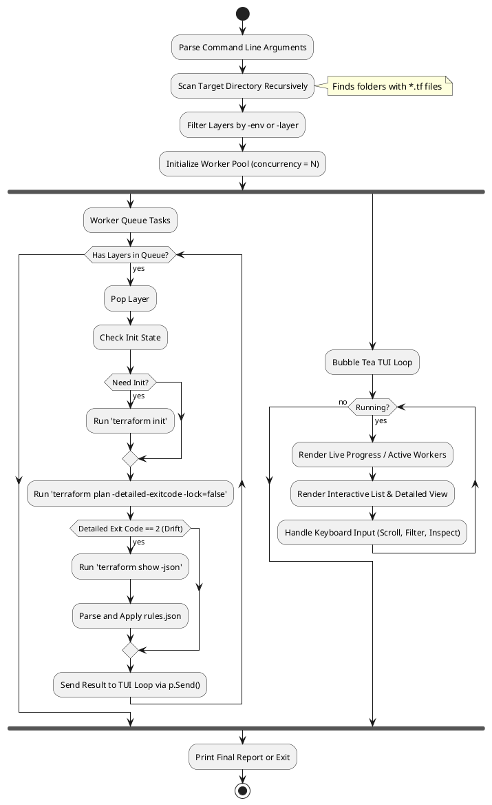
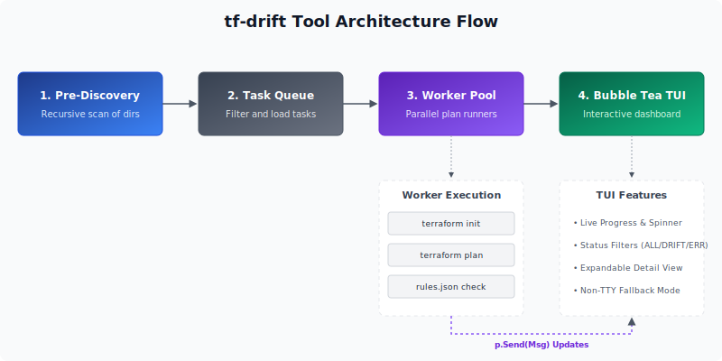

# CLI Drift Detection Tool (tf-drift)

`tf-drift` is a Go-based CLI tool designed to recursively scan, detect, filter, and display configuration drift across multiple Terraform workspaces/layers in a workspace (like `your-infrastructure-dir`).

## Architecture & Workflow

The tool operates in three distinct phases:
1. **Pre-Discovery (Recursive Scanning):** Walk the target directory (defaulting to the current working directory `.`) to identify all directories containing `.tf` files and a backend configuration block.
2. **Parallel Processing (Worker Pool):** Queue identified layers into a concurrent worker pool of a bounded size (configured via `-concurrency`). For each layer, run `terraform init` (if needed) and `terraform plan -detailed-exitcode -lock=false`.
3. **Interactive display (Bubble Tea TUI):** Present a live, modern dashboard indicating active workers, scanning progress, and a scrollable table of layers. Allows filtering by status and expanding drifted layers to inspect detailed changes.

### PlantUML Workflow Diagram

## TUI Layout & Features
* **Progress Bar:** Interactive indicator of processed layers vs total layers.
* **Scrollable Table:** List of layers showing the relative path, environment, status (`OK`, `DRIFTED`, `ERROR`, `SCANNING`, `PENDING`), and drift severity.
* **Expanded View:** Selecting a layer and pressing `Enter` displays the detailed diff or error message in an inspector pane.
* **Filters:** Pressing `f` cycles filters (`ALL` -> `DRIFTED` -> `ERRORS`).
* **Non-Interactive Fallback:** Fallback to stdout reporting when not executed in a TTY.

## Decision Log

| ID | Date | Decision | Rationale |
| :--- | :--- | :--- | :--- |
| DEC-001 | 2026-06-15 | Use native `terraform plan` | Ensures 100% compatibility with custom providers and versions. |
| DEC-002 | 2026-06-15 | Default to `-lock=false` | Prevents blocking active deployment pipelines. |
| DEC-003 | 2026-06-15 | Use Charm CLI `bubbletea` | Gold standard for interactive, modern Go terminal interfaces. |
| DEC-004 | 2026-06-15 | Worker pool reports via `p.Send()` | Safely queues UI updates into the Bubble Tea runtime thread. |

## References
* [Bubble Tea Docs](https://github.com/charmbracelet/bubbletea)
* [Terraform Show JSON Output Format](https://developer.hashicorp.com/terraform/internals/json-format)
