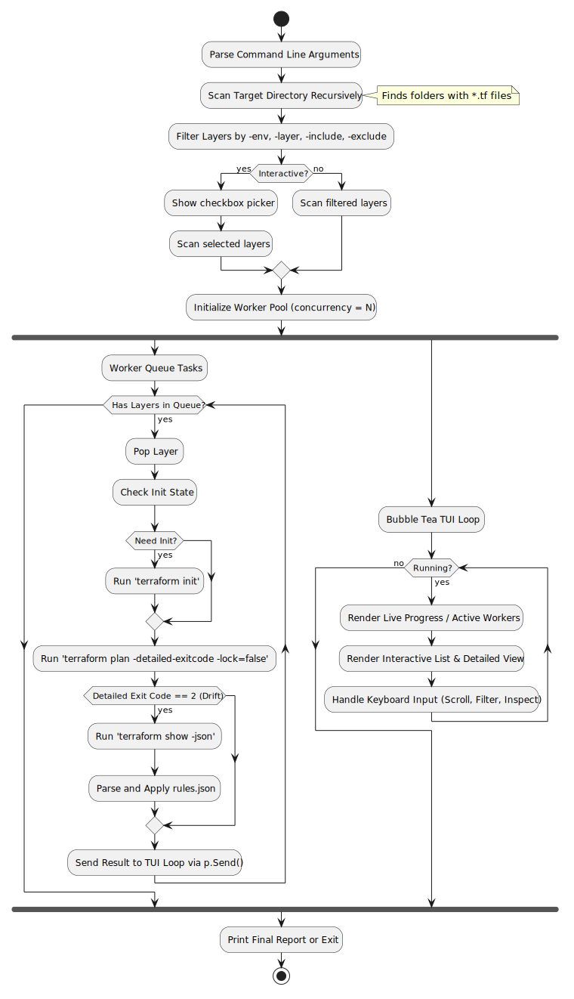

# CLI Drift Detection Tool (tf-drift)

`tf-drift` is a Go-based CLI tool designed to recursively scan, detect, filter, and display configuration drift across multiple Terraform or OpenTofu workspaces/layers in a workspace (like `your-infrastructure-dir`).

## Architecture & Workflow

The tool operates in four distinct phases:
1. **Pre-Discovery (Recursive Scanning):** Walk the target directory (defaulting to the current working directory `.`) to identify all directories containing `.tf` files and a backend configuration block.
2. **Selection:** Apply `-env`, `-layer`, `-include`, and `-exclude`, then optionally show a checkbox picker in interactive mode.
3. **Parallel Processing (Worker Pool):** Resolve the selected IaC engine, queue selected layers into a concurrent worker pool of a bounded size (configured via `-concurrency`), and for each layer run `<engine> init` (if needed) and `<engine> plan -detailed-exitcode -lock=false`.
4. **Interactive display (Bubble Tea TUI):** Present a live, modern dashboard indicating active workers, scanning progress, and a scrollable table of layers. Allows filtering by status and expanding drifted layers to inspect detailed changes.

### Workflow Diagram

The workflow now includes a selection step before workers start.

## TUI Layout & Features
* **Pre-scan Picker:** Interactive checkbox list for selecting which discovered configs to scan.
* **Progress Bar:** Interactive indicator of processed layers vs total layers.
* **Scrollable Table:** List of layers showing the relative path, environment, status (`OK`, `DRIFTED`, `ERROR`, `SCANNING`, `PENDING`), and drift severity.
* **Expanded View:** Selecting a layer and pressing `Enter` displays the detailed diff or error message in an inspector pane.
* **Filters:** Pressing `f` cycles filters (`ALL` -> `DRIFTED` -> `ERRORS`).
* **Non-Interactive Fallback:** Fallback to stdout reporting when not executed in a TTY.

## Display Paths

TUI views and human-readable reports shorten paths under the current user's home directory with `~`. This keeps app output readable and avoids displaying `/Users/<name>`, `/home/<name>`, or `/root` in normal UI surfaces. Engine execution, layer selection, rules evaluation, and JSON output keep raw paths for compatibility.

## Engine Selection

The `-engine` flag selects which executable runs plans:

| Value | Behavior |
| :--- | :--- |
| `auto` | Default. Prefer `tofu` when present, then fall back to `terraform`. |
| `terraform` | Require the `terraform` executable. |
| `opentofu` or `tofu` | Require the `tofu` executable. |

The resolved executable is used consistently for `init`, `plan`, and `show -json`. Error messages must name the selected executable so CI logs explain whether Terraform or OpenTofu failed. Non-interactive runs set `TF_IN_AUTOMATION=1` for child commands.

OpenTofu compatibility depends on the same plan JSON contract used by Terraform-compatible versions. The runner keeps `TF_PLUGIN_CACHE_DIR` behavior and continues to treat `.terraform` as the default data directory because OpenTofu preserves those compatibility surfaces.

OpenTofu-specific suggestions should focus on known migration failures: missing explicit provider source addresses, registry resolution changes, provider version jumps, state encryption key configuration, and saved plan sensitivity.

## Version Reporting

The CLI exposes `-version` and `-v` as aliases. Both print `tf-drift <version>` and exit before discovery or engine resolution.

Official release binaries receive the exact release tag from GoReleaser through `-ldflags "-X main.version={{.Version}}"`, so `tf-drift -version` reports values such as `tf-drift v1.0.0`. Local `make build` and `make install` inject `git describe --tags --always --dirty` so source builds report the nearest tag, commit, and dirty marker instead of plain `dev`.

## Decision Log

| ID | Date | Decision | Rationale |
| :--- | :--- | :--- | :--- |
| DEC-001 | 2026-06-15 | Use native engine `plan` | Ensures compatibility with custom providers and engine versions. |
| DEC-002 | 2026-06-15 | Default to `-lock=false` | Prevents blocking active deployment pipelines. |
| DEC-003 | 2026-06-15 | Use Charm CLI `bubbletea` | Gold standard for interactive, modern Go terminal interfaces. |
| DEC-004 | 2026-06-15 | Worker pool reports via `p.Send()` | Safely queues UI updates into the Bubble Tea runtime thread. |
| DEC-005 | 2026-06-19 | Default `-engine` to `auto` | Supports OpenTofu first when installed while keeping Terraform fallback for existing users. |
| DEC-006 | 2026-06-19 | Shorten displayed home paths with `~` | Keeps terminal and app output compact without changing execution paths. |
| DEC-007 | 2026-06-19 | Keep version reporting build-time driven | Release tags come from GoReleaser ldflags, while source builds use git metadata without runtime git calls. |

## References
* [Bubble Tea Docs](https://github.com/charmbracelet/bubbletea)
* [Terraform Show JSON Output Format](https://developer.hashicorp.com/terraform/internals/json-format)
* [OpenTofu Migration Guide](https://opentofu.org/docs/intro/migration/)
* [OpenTofu Compatibility Promises](https://opentofu.org/docs/language/v1-compatibility-promises/)
