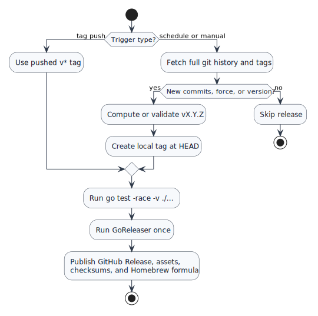

# Scheduled Release Automation

## Problem and Goal

Releases currently require a pushed `v*` tag. That keeps publishing explicit, but it also means new commits can sit unreleased until someone remembers to tag. The goal is to add a daily GitHub Actions release path that publishes only when the default branch has commits after the latest stable tag.

## Scope

The release workflow should:

- Run daily at midnight UTC with `cron: '0 0 * * *'`.
- Keep manual `v*` tag pushes working.
- Allow manual GitHub Actions dispatch with an optional `vX.Y.Z` override.
- Skip scheduled runs when no commits exist after the latest stable `vX.Y.Z` tag.
- Compute a SemVer bump from Conventional Commit messages when no manual tag is supplied.
- Run the Go race test suite before publishing.
- Run GoReleaser once in the same workflow to avoid `GITHUB_TOKEN` recursive workflow trigger gaps.

Out of scope:

- Moving the Homebrew formula release path to GoReleaser casks.
- Changing the binary build matrix.
- Replacing GoReleaser with Release Please or semantic-release.

## Workflow

The workflow avoids a separate tagger workflow. Scheduled and manual dispatch runs create a local tag at the checked-out commit, then GoReleaser publishes the GitHub Release and release tag.

## Version Rules

- `BREAKING CHANGE:` in a commit body or `!` in a Conventional Commit subject triggers a major bump.
- `feat:` triggers a minor bump.
- Any other new commit triggers a patch bump.
- A manual `version` input must match `vX.Y.Z`.
- Existing tags are never recreated.

## Edge Cases

- Schedule runs are best-effort on GitHub Actions, so `workflow_dispatch` remains available for manual recovery.
- A workflow-created tag using `GITHUB_TOKEN` would not trigger a second workflow; the design publishes from the same job instead.
- Concurrent release runs are serialized with a workflow-level concurrency group.
- GoReleaser receives `target_commitish: "{{ .Commit }}"` so the release tag points at the exact commit being released.

## Acceptance Criteria

- `.github/workflows/release.yml` includes a daily midnight UTC schedule.
- Pushed `v*` tags still run the existing GoReleaser release path.
- Scheduled runs skip when the latest stable tag already points at `HEAD`.
- Scheduled runs compute the expected next tag from commits after the latest stable tag.
- The workflow runs `go test -race -v ./...` before GoReleaser.
- `actionlint` passes for the release workflow.

## Test Plan

- Run `go test -race -v ./...`.
- Run `actionlint` against `.github/workflows/release.yml`.
- Run `git diff --check`.
- Simulate the SemVer calculation against the current local tag history.
- Run `goreleaser check` to catch configuration errors and record any pre-existing deprecation warnings.
