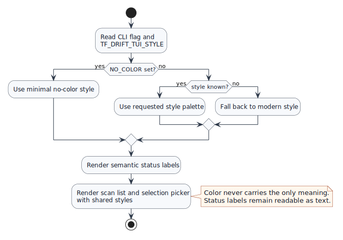

# TUI Style System

`tf-drift` should support modern terminal interface styles without changing scan behavior, worker behavior, or non-interactive output.

## Problem And Goal

The current TUI renders raw ANSI escape sequences directly in the scan dashboard and config picker. That makes colors hard to update, creates duplicated row highlighting logic, and makes accessibility choices difficult to enforce.

Goal: add a small semantic style layer that supports `modern`, `classic`, `minimal`, and `accessible` TUI styles while preserving current keyboard shortcuts, status text, filters, and detail navigation.

## Flow

The style resolver reads a CLI flag and environment variable, falls back predictably, and respects no-color mode before rendering either TUI.

## Scope

- Add a shared style system for scan and selection TUIs.
- Add a public CLI option for selecting the style.
- Keep status labels textual: `CLEAN`, `DRIFTED`, `ERROR`, `SCANNING`, and `PENDING`.
- Keep current TUI controls and state transitions.
- Keep non-interactive reports unchanged.

## Non-Goals

- No pane-based dashboard rewrite.
- No new Terraform scan behavior.
- No theme file format.
- No dependency on external terminal design tools.

## Style Names

| Style | Purpose |
| --- | --- |
| `modern` | Default polished style with semantic colors and clear focus rows. |
| `classic` | Close to existing cyan/red/green/yellow ANSI feel. |
| `minimal` | Low-decoration style for plain terminals and `NO_COLOR`. |
| `accessible` | High-contrast style that avoids relying on color alone. |

## Acceptance Criteria

- `tf-drift -tui-style modern` uses the modern style.
- `TF_DRIFT_TUI_STYLE=accessible tf-drift ...` selects accessible style when the flag is absent.
- Unknown style names fall back to `modern`.
- `NO_COLOR` forces `minimal`.
- Selection picker and scan dashboard use the same semantic style helpers.
- Existing tests for scrolling, filtering, selection, and scan result updates continue to pass.

## Test Plan

- Unit-test style resolution for default, flag, environment, unknown, and `NO_COLOR`.
- Unit-test semantic status rendering still includes readable status text.
- Unit-test selection picker rendering still includes checkbox rows and controls.
- Run `go test ./...`.

## Rollout Notes

This is safe as a default behavior change because it preserves text labels and command semantics. Users who prefer lower decoration can opt into `minimal`, and automation should still use `-non-interactive`.
