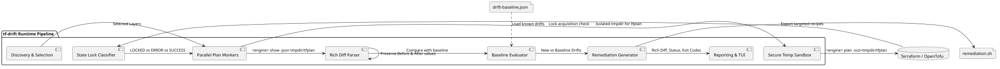

# V2 Drift Engine Evolution

## Problem and Goal

While `tf-drift` classifies external drift versus planned changes using native engine execution, five operational friction points limit production enterprise adoption:
1. **Plan Contamination:** `tfplan` binary files are written directly into workspace directories, risking dirty git trees and sensitive data leaks if terminated.
2. **State Lock Blindness:** Lock contention during active deployments produces generic exit code 1 failures, masking drift detection.
3. **Diff Blindness:** Changed attribute names are reported without `before` and `after` values, forcing operators to leave the tool to inspect changes.
4. **Day-1 CI Adoption Barrier:** Existing environments with pre-existing legacy drift fail CI builds immediately without an incremental baseline mechanism.
5. **Actionability Gap:** Detected drift lacks immediate, targeted remediation recipes (`apply -target` vs `apply -refresh-only`).

The goal is to evolve `tf-drift` with secure plan isolation, state lock classification, rich attribute diff preservation, baseline snapshotting, and targeted remediation generation.

## Scope & Non-Goals

### In Scope
* Isolated temp directories (`0700`) for plan binary creation and guaranteed cleanup.
* Lock detection recognizing `Error acquiring the state lock` with `LOCKED` layer status and exit code `4`.
* Rich attribute diffs retaining `Before` and `After` states with unified diff rendering in TUI and reports.
* Baseline mechanism (`-baseline <file>` and `-update-baseline`) suppressing acknowledged drift from failure exit codes.
* Remediation recipes (`-export-remediation <file>` and TUI detail inspector commands).

### Non-Goals
* Direct AWS/GCP SDK calls inside the CLI core (prevents binary bloat and cloud API throttling).
* Automated destructive applies without human review.

## Architecture & Diagram

### Diagram: V2 Drift Engine Pipeline



This diagram shows the end-to-end execution flow of the hardened V2 engine pipeline. Read it when evaluating runner isolation, state lock handling, baseline filtering, and remediation generation.

* **Main entities:** `Secure Temp Sandbox` isolates filesystem writes away from the repository tree; `State Lock Classifier` catches concurrent deployment locks; `Rich Diff Parser` retains full value diffs; `Baseline Evaluator` separates known technical debt from new drift; `Remediation Generator` creates copy-paste commands.
* **Flow:** 
  1. Discovery identifies selected layers.
  2. Workers run in an isolated temp sandbox directory per layer.
  3. Plan execution detects state lock collisions before processing.
  4. Structured plan JSON retains before/after values.
  5. Baseline evaluator flags new vs acknowledged drift.
  6. Remediation recipes are exported or rendered in TUI/reports.
* **Failure/edge paths:** If a lock is held, the layer enters `LOCKED` status without corrupting reports. If temp directory creation fails, workers fail fast with clean teardown.
* **References:** [runner.go](../../internal/drift/runner.go), [worker.go](../../internal/drift/worker.go), [tui.go](../../internal/drift/tui.go), [rules.go](../../internal/drift/rules.go).

## Data Model & Interfaces

### Attribute Diff Representation

```go
type AttributeDiff struct {
	Attribute string      `json:"attribute"`
	Before    interface{} `json:"before,omitempty"`
	After     interface{} `json:"after,omitempty"`
}

type DriftChange struct {
	Address           string               `json:"address"`
	Type              string               `json:"type"`
	Actions           []string             `json:"actions"`
	ChangedAttributes []string             `json:"changed_attributes"`
	AttributeDiffs    []AttributeDiff      `json:"attribute_diffs,omitempty"`
	Severity          string               `json:"severity"`
	Classification    ChangeClassification `json:"classification"`
	ActionReason      string               `json:"action_reason,omitempty"`
	Acknowledged      bool                 `json:"acknowledged,omitempty"`
}
```

### Baseline Schema (`drift-baseline.json`)

```json
{
  "version": "1.0",
  "updated_at": "2026-10-03T23:10:00Z",
  "entries": [
    {
      "layer": "terraform/aws/vpc",
      "address": "aws_security_group.default",
      "type": "aws_security_group",
      "attributes": ["ingress"]
    }
  ]
}
```

## Exit Code Contract

* `0`: Clean (no drift, no planned changes, or all drift acknowledged in baseline).
* `1`: Engine execution error or unhandled fatal failure.
* `2`: External drift detected (unacknowledged / new drift).
* `3`: Pending config changes only (under `-mode both` or `-mode plan`).
* `4`: State locked by active deployment (when `-on-locked=fail`).

## Acceptance Criteria

1. **Zero Workspace Contamination:** No `.tfplan` files appear in the repository tree during or after execution.
2. **Lock Classification:** State lock errors are captured, displayed as `LOCKED`, and exit with code `4` (or skipped if `-on-locked=skip`).
3. **Rich Diff Rendering:** TUI detail view shows `Before` and `After` values for changed attributes with visual indicator.
4. **Baseline Matching:** Running with `-baseline` suppresses acknowledged drift from triggering exit code `2`.
5. **Remediation Output:** `-export-remediation <file>` generates a valid shell script containing targeted `apply` and `refresh-only` commands.

## Test Plan

* Unit tests in `internal/drift/runner_test.go` verifying tempfile directory creation and deletion.
* Unit tests for lock error string detection and status mapping.
* Unit tests verifying `AttributeDiff` extraction from `change.Before` and `change.After`.
* Unit tests in `internal/drift/baseline_test.go` verifying baseline loading, matching, and saving.
* Unit tests in `internal/drift/remediation_test.go` verifying command generation for Terraform and OpenTofu.
