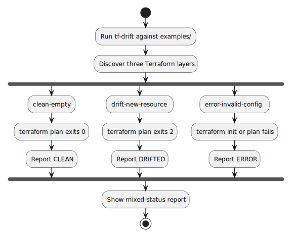

# Example Terraform Status Fixtures

## Problem and Goal

The repository needs runnable Terraform examples that let a developer see more than one `tf-drift` status in a single scan. The examples should require no cloud credentials and should exercise the public CLI path, not a mocked report.

## Scope

Create an `examples/` directory with three independently discovered Terraform layers:

- `clean-empty`: valid Terraform with no managed resources, expected to report `CLEAN`.
- `drift-new-resource`: valid Terraform using the built-in `terraform_data` resource, expected to report `PLANNED` before state exists because it is an unapplied config change, not external infrastructure drift.
- `error-invalid-config`: intentionally invalid Terraform, expected to report `ERROR`.

The examples should work with `tf-drift -dir examples -non-interactive` and with JSON output. They should avoid external providers, remote state, and cloud credentials.

## Workflow

The diagram shows how the three fixture layers map to `tf-drift` statuses.

## Acceptance Criteria

- `tf-drift -dir examples -non-interactive` discovers three example layers.
- The report includes one `CLEAN`, one `PLANNED`, and one `ERROR` result.
- The drift example uses only Terraform's built-in `terraform_data` resource.
- `README.md` and `examples/README.md` document the commands and expected statuses.

## Test Plan

- Add a focused Go test that asserts the repository examples are discoverable as three layers.
- Run the focused test before adding the examples to confirm it fails for the missing fixtures.
- Run the focused test and full Go test suite after implementation.
- Run the CLI against `examples/` in non-interactive text and JSON modes.
