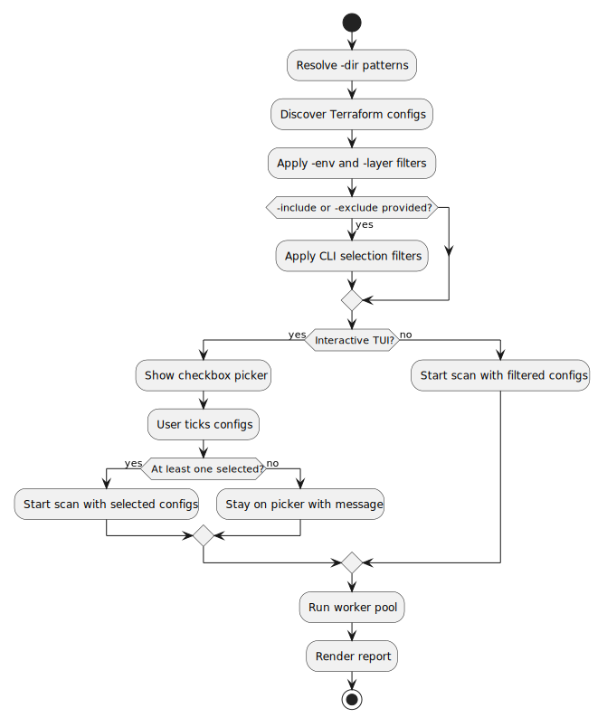

# Terraform Config Selection

## Problem and Goal

`tf-drift` scans every discovered Terraform layer after `-dir`, `-env`, and `-layer` filtering. Users need one more narrowing step: interactive users should be able to tick the detected configs they want to check, and CI users should be able to include or exclude configs with flags.

## Scope

Add selection in two surfaces:

- Interactive TUI: show a pre-scan checkbox list of detected configs.
- Non-interactive CLI: add `-include` and `-exclude` flags for comma-separated suffix or glob patterns.

Selection applies before the worker pool starts. The existing scanning, reporting, exit-code, and detail-inspector behavior stays unchanged once the selected list is built.

## Workflow

The diagram shows selection as a shared step between discovery and scanning.



## Interaction Contract

The interactive picker defaults every discovered config to selected. Keyboard controls:

- `space`: tick or untick the current config.
- `a`: select all configs.
- `n`: select none.
- `enter`: start scanning selected configs.
- `q` or `ctrl+c`: quit without scanning.

If the user presses `enter` with no configs selected, the picker stays open and shows `Select at least one config`.

## CLI Contract

`-include` and `-exclude` accept comma-separated patterns. Patterns match config base names, relative suffixes, and slash-separated path suffixes. Include runs first, then exclude.

Examples:

```bash
tf-drift -dir examples -non-interactive -include "clean-empty,drift-*"
tf-drift -dir examples -non-interactive -exclude "error-*"
```

## Acceptance Criteria

- TUI mode shows a checkbox picker before scanning starts.
- TUI users can tick/untick, select all, select none, quit, and start scanning.
- TUI users cannot start a scan with zero selected configs.
- Non-interactive mode supports `-include` and `-exclude`.
- Include and exclude filters preserve layer order.
- The worker pool only receives selected layers.
- README documents the new controls and flags.

## Test Plan

- Unit test include/exclude matching and ordering.
- Unit test picker key behavior for tick, all, none, enter, and empty selection.
- Run `go test ./...`, `go vet ./...`, and `make build`.
- Run examples with `-include` and `-exclude` to verify selected statuses.
